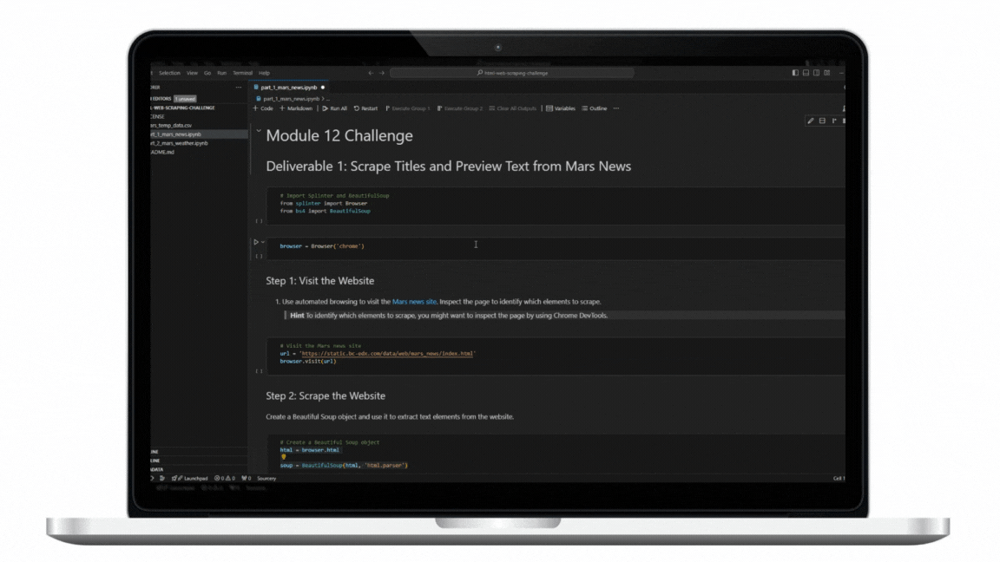

<h1  align="center">HTML Web Scraping Challenge</h1>

<!-- TABLE OF CONTENTS -->

Table of Contents
<ol>
<li><a href="#about-the-project">About The Project</a></li>
<li><a href="#built-with-beautifulsoup-and-splinter-framework">Built With BeautifulSoup and Splinter Framework</a></li>
<li><a href="#contributing">Contributing (UC Berkeley Bootcamp Students Only) </a></li>
<li><a href="#contact">Contact</a></li>
<li><a href="#acknowledgments">Acknowledgments</a></li>
</ol>

<!-- ABOUT THE PROJECT -->

## About The Project

### Background
You’re now ready to take on a full web-scraping and data analysis project. You’ve learned to identify HTML elements on a page, identify their `id` and `class` attributes, and use this knowledge to extract information via both automated browsing with Splinter and HTML parsing with Beautiful Soup. You’ve also learned to scrape various types of information. These include HTML tables and recurring elements, like multiple news articles on a webpage.

### Instructions
This new assignment consists of two technical products. You will submit the following deliverables:

- Deliverable 1: Scrape titles and preview text from Mars news articles.

- Deliverable 2: Scrape and analyze Mars weather data, which exists in a table.

## Part 1: Scrape Titles and Preview Text from Mars News

Open the Jupyter Notebook in the starter code folder named `part_1_mars_news.ipynb`. You will work in this code as you follow the steps below to scrape the Mars News website.

1. Use automated browsing to visit the `Mars news site`. Inspect the page to identify which elements to scrape.
   
<kbd>  </kbd>

3. Create a `Beautiful Soup` object and use it to extract text elements from the website.

4. Extract the titles and preview text of the news articles that you scraped. Store the scraping results in Python data structures as follows:

- Store each title-and-preview pair in a Python dictionary and, give each dictionary two keys: `title` and `preview`. An example is the following:
  

- Store all the dictionaries in a Python list.

- Print the list in your notebook.

## Part 2: Scrape and Analyze Mars Weather Data

Open the Jupyter Notebook in the starter code folder named `part_2_mars_weather`.ipynb. You will work in this code as you follow the steps below to scrape and analyze Mars weather data.

1. Use automated browsing to visit the `Mars Temperature Data Site`. Inspect the page to identify which elements to scrape. Note that the URL is `https://static.bc-edx.com/data/web/mars_facts/temperature.html`.
   
<kbd>  </kbd>

3. Create a Beautiful Soup object and use it to scrape the data in the HTML table. Note that this can also be achieved by using the Pandas `read_html` function. However, use Beautiful Soup here to continue sharpening your web scraping skills.

4. Assemble the scraped data into a Pandas DataFrame. The columns should have the same headings as the table on the website. Here’s an explanation of the column headings:

- `id`: the identification number of a single transmission from the Curiosity rover
terrestrial_date: the date on Earth
- `sol`: the number of elapsed sols (Martian days) since Curiosity landed on Mars
- `ls`: the solar longitude
- `month`: the Martian month
- `min_temp`: the minimum temperature, in Celsius, of a single Martian day (sol)
- `pressure`: The atmospheric pressure at Curiosity's location

4. Examine the data types that are currently associated with each column. If necessary, cast (or convert) the data to the appropriate `datetime`, `int`, or `float` data types.

5. Analyze your dataset by using Pandas functions to answer the following questions:

- How many months exist on Mars?
- How many Martian (and not Earth) days worth of data exist in the scraped dataset?
- What are the coldest and the warmest months on Mars (at the location of Curiosity)? To answer this question:
    - Find the average minimum daily temperature for all of the months.
    - Plot the results as a bar chart.
      

- Which months have the lowest and the highest atmospheric pressure on Mars? To answer this question:
    - Find the average daily atmospheric pressure of all the months.
    - Plot the results as a bar chart.
      

- About how many terrestrial (Earth) days exist in a Martian year? To answer this question:
    - Consider how many days elapse on Earth in the time that Mars circles the Sun once.
    - Visually estimate the result by plotting the daily minimum temperature.

6. Export the DataFrame to a CSV file.
   

(<a  href="#readme-top">back to top</a>)

  
<!-- BUILT -->

## Built with BEAUTIFULSOUP and SPLINTER Framework 

- `BeautifulSoup`: A Python library designed for parsing HTML and XML documents. It creates a parse tree for parsed pages that can be used to extract data from HTML, such as text, links, images, and more. Common use cases:
    - Extracting data from websites
    - Building web scrapers.
    - Parsing HTML content for analysis

- `Splinter`: A Python library built on top of Selenium WebDriver, providing a higher-level abstraction for browser interaction. It allows you to control a web browser programmatically, simulating user actions like clicking, typing, and navigating. Common use cases:
    - Web testing and automation
    - Form filling and submission
    - Scraping dynamic websites
    - Capturing screenshots
  
  
(<a  href="#readme-top">back to top</a>)

<!-- CONTRIBUTING -->

## Contributing 

(UC Berkeley Bootcamp Students Only)  

Contributions are what make the open source community such an amazing place to learn, inspire, and create. Any contributions you make are **greatly appreciated**.

  

If you have a suggestion that would make this better, please fork the repo and create a pull request. You can also simply open an issue with the tag "enhancement".

Don't forget to give the project a star! Thanks again!

1. Fork the Project

2. Create your Feature Branch (`git checkout -b new-branch-name`)

3. Commit your Changes (`git commit -m 'Add some message'`)

4. Push to the Branch (`git push origin new-branch-name`)

5. Create a pull request. 

Forking a repository and creating a pull request on GitHub is a great way to contribute to open-source projects. Here's a breakdown of the process:

1. Forking the Repository:

Find the repository you want to contribute to on GitHub.
Click on the "Fork" button in the top right corner. This creates a copy of the repository in your own account.

2. Clone the Forked Repository to Your Local Machine

You'll need Git installed on your system.
Use Git commands to clone your forked repository to your local machine. There will be instructions on the GitHub repository page for cloning.

3. Making Changes (Local Work):

Make your changes to the code in your local copy.
Use Git commands to track your changes (adding, committing).

4. Pushing Changes to Your Fork:

Once you're happy with your changes, use Git commands to push your local commits to your forked repository on GitHub.

5. Creating a Pull Request:

Go to your forked repository on GitHub.
Click the "Compare & pull request" button (might appear as a yellow banner).
Here, you'll see a comparison between your changes and the original repository.
Write a clear title and description for your pull request explaining the changes you made.
Click "Create Pull Request" to submit it for review.

(<a  href="#readme-top">back to top</a>)

<!-- LICENSE -->

## License

Distributed under  GNU General Public License. See `LICENSE.txt` for more information.

(<a  href="#readme-top">back to top</a>)

<!-- CONTACT -->

## Contact

Thay Chansy - [@thaychansy](https://twitter.com/thaychansy) - or thay.chansy@gmail.com

Please visit my Portfolio Page: thaychansy.github.io (https://thaychansy.github.io/)

Project Link: [thaychansy/html-web-scraping-challenge (github.com)](https://github.com/thaychansy/html-web-scraping-challenge)
  

(<a  href="#readme-top">back to top</a>)

   
  

<!-- ACKNOWLEDGMENTS -->

## Acknowledgments

Here's a list of resources we found helpful and would like to give credit to. 

  
* [Chat GPT] [ChatGPT](https://chatgpt.com/)
* [Google Gemini] [Gemini Generative AI](https://gemini.google.com/app)
  

(<a  href="#readme-top">back to top</a>)

